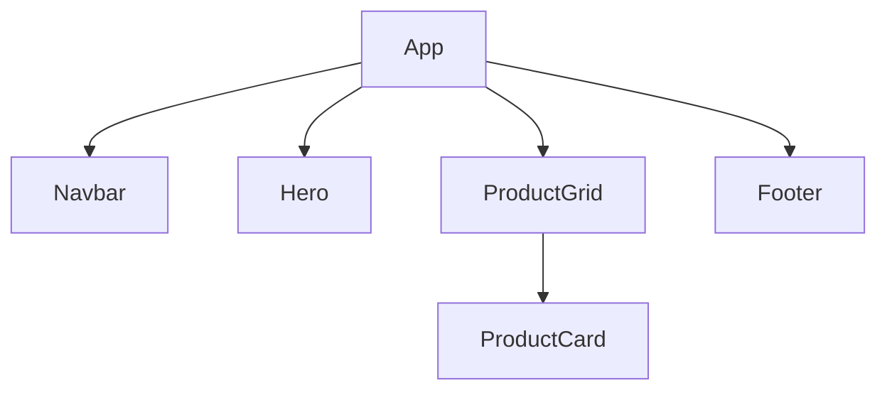

# Component Tree

## Props

- Navbar: `logo`, `links`
- Hero: `title`, `subtitle`, `buttonText`
- ProductGrid: `title`, `products`
- ProductCard: `image`, `name`, `price`
- Footer: `text`

## Why split

- `Navbar` is reused across pages.
- `Hero` is a standalone banner section.
- `ProductCard` repeats for every product.
- `ProductGrid` handles layout, not card content.
- `Footer` is a shared page ending.
